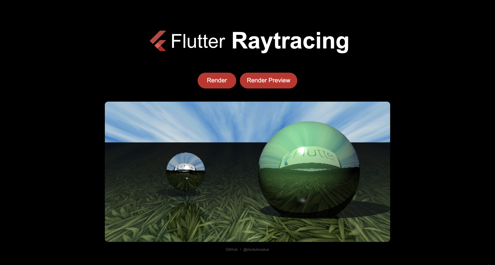

# flutter_raytracing

    

[(Old) Demo](https://modulovalue.com/flutter_raytracing)

### Note (2021)
This was rewritten to only depend on vector_math and image.
You could use this in any flutter app if you want to.
This doesn't depend on flutter anymore.
See packages/flutter_web/bin/render.dart

Original work by [Ben Coleman @BenCodeGeek](https://twitter.com/BenCodeGeek)
Rewritten by [Modestas Valauskas @modulovalue](https://twitter.com/modulovalue)
